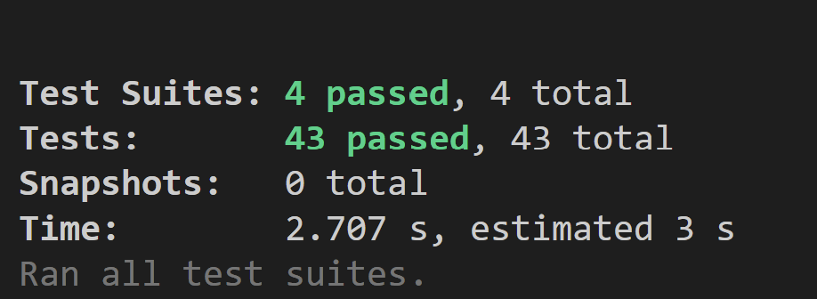
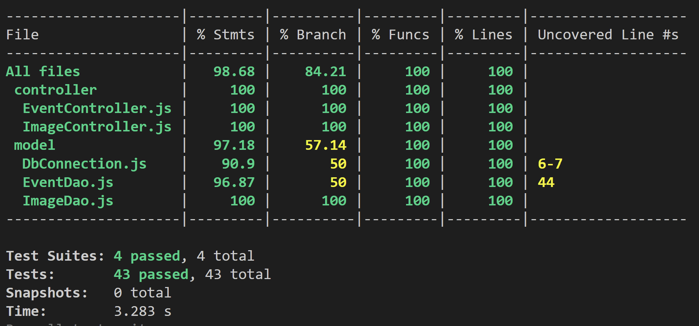
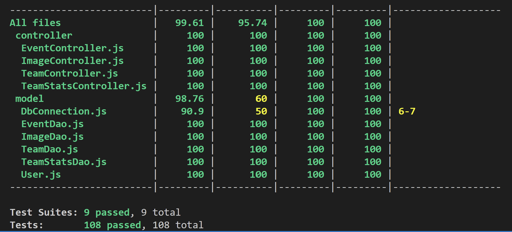

# Coverage report
This section provides an overview of the code coverage for the project, highlighting the extent to which the codebase is tested by automated tests. Code coverage is a measure of how much of the source code is executed when the test suite runs. Higher coverage percentages generally indicate a more thoroughly tested codebase, which can lead to increased reliability and maintainability.

# Coverage Report Iteration 1-2
test:

coverage:

# Coverage Report Iteration 3
